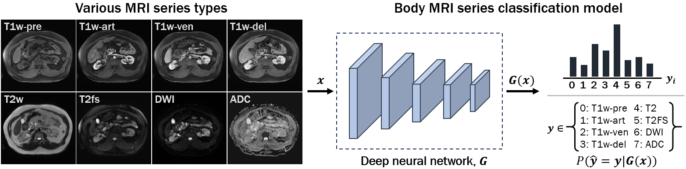

# 3D MRI Series Classifier
Official repository for "Classification of Multi-Parametric Body MRI Series Using Deep Learning", published in IEEE Journal of Biomedical and Health Informatics.

[[IEEE JBHI paper](https://ieeexplore.ieee.org/document/10645214)]




## 1. Installation
You may need Conda environment. You can download Anaconda from this [link](https://www.anaconda.com/download).
Then, please run:
```
conda env create –f mriclassifier_env.yml
conda activate mriclassifier
```

## 2. Dataset
This code runs using NIFTI (.nii.gz) files. Please put your NIFTI files into ./data.
For preprocessing data, please run:
```
python data_preprocessing.py
```
Then, the processed data will be saved in ./data/preprocessed.

* If you use our pre-trained model, please preprocess the data using the above code, which resamples the 3D MRI volumes.

## 3-1. Train

To train our model, run the following command:

```train
sh train.sh
```
The checkpoints of the model will be saved in ./checkpoint/.

## 3-2. Test

To test the trained our model, run:

```eval
sh test.sh
```
The results of the MRI classification such as the confusion matrix will be saved in ./results.

* Here, we have provided our pre-trained model which was trained on the Siemens scanner data and then finetuned on the Philips scanner data (Please see Strategy 2 in Table 2 of the paper).
* To use our pre-trained model, please download the model weights from [here](https://nihcc.box.com/s/x9gy5qc3b1ubae3xcmdbzcl5wxrz885c) and put the weights in ./pretrained_model.

Citation
===============
```
@article{kimclassification,
  title={Classification of Multi-Parametric Body MRI Series Using Deep Learning},
  author={Kim, Boah and Mathai, Tejas Sudharshan and Helm, Kimberly and Pinto, Peter A and Summers, Ronald M},
  journal={IEEE journal of biomedical and health informatics}
}
```
